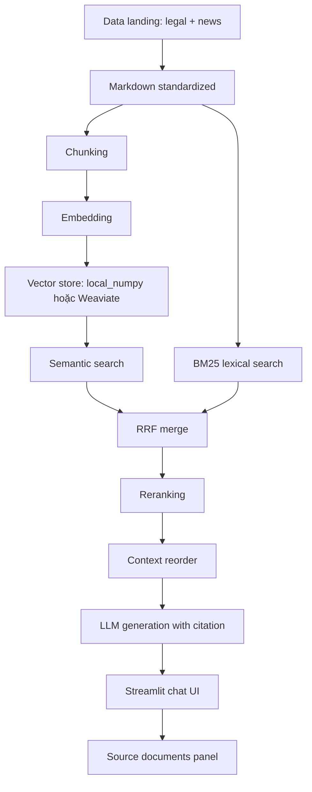

# Day08 RAG Pipeline Cohort 2

Repo nộp bài ngày 8 cho chủ đề RAG pipeline trên dữ liệu pháp luật Việt Nam về ma tuý, chất cấm và các bài báo liên quan.

## Thông Tin Sinh Viên

| Họ tên | MSSV | Vai trò chính |
| --- | --- | --- |
| Nguyễn Mạnh Quý | 2A202600643 | Retrieval backend, hybrid search, vector store, reranking |

## Tổng Quan

Dự án xây dựng pipeline RAG từ dữ liệu gốc đến chatbot demo:

1. Thu thập văn bản pháp luật và bài báo.
2. Chuẩn hoá tài liệu sang Markdown.
3. Chunking, embedding và indexing.
4. Truy vấn semantic search, lexical BM25, hybrid merge và reranking.
5. Sinh câu trả lời có citation.
6. Tích hợp thành chatbot Streamlit trong `group_project`.

Chủ đề dữ liệu:

- Văn bản pháp luật Việt Nam về ma tuý và các chất cấm.
- Bài báo về nghệ sĩ/người nổi tiếng Việt Nam liên quan tới ma tuý.

## Cấu Trúc Dự Án

```text
.
├── README.md
├── requirements.txt
├── data/
│   ├── landing/
│   │   ├── legal/          # File gốc DOCX/Markdown pháp luật
│   │   └── news/           # File JSON bài báo đã crawl
│   ├── standardized/
│   │   ├── legal/          # Markdown pháp luật đã chuẩn hoá
│   │   └── news/           # Markdown bài báo đã chuẩn hoá
│   └── index/
│       └── local_chunks.json
├── src/
│   ├── task1_collect_legal_docs.py
│   ├── task2_crawl_news.py
│   ├── task3_convert_markdown.py
│   ├── task4_chunking_indexing.py
│   ├── task5_semantic_search.py
│   ├── task6_lexical_search.py
│   ├── task7_reranking.py
│   ├── task8_pageindex_vectorless.py
│   ├── task9_retrieval_pipeline.py
│   └── task10_generation.py
├── group_project/
│   ├── app.py              # Streamlit chat UI
│   ├── rag_chatbot.py      # RAG backend cấu hình được
│   ├── README.md
│   └── evaluation/
│       ├── golden_dataset.json
│       ├── eval_pipeline.py
│       └── results.md
└── tests/
    └── test_individual.py
```

## Pipeline Cá Nhân

| Task | Nội dung | File chính |
| --- | --- | --- |
| 1 | Thu thập văn bản pháp luật | `src/task1_collect_legal_docs.py` |
| 2 | Crawl bài báo | `src/task2_crawl_news.py` |
| 3 | Convert sang Markdown | `src/task3_convert_markdown.py` |
| 4 | Chunking và indexing | `src/task4_chunking_indexing.py` |
| 5 | Semantic search | `src/task5_semantic_search.py` |
| 6 | Lexical search BM25 | `src/task6_lexical_search.py` |
| 7 | Reranking | `src/task7_reranking.py` |
| 8 | PageIndex vectorless fallback | `src/task8_pageindex_vectorless.py` |
| 9 | Retrieval pipeline hoàn chỉnh | `src/task9_retrieval_pipeline.py` |
| 10 | Generation có citation | `src/task10_generation.py` |

## Sản Phẩm Nhóm

Nhóm chọn yêu cầu RAG Chatbot bằng Streamlit.

Tính năng chính:

- Giao diện chat bằng `Streamlit`.
- Sidebar chọn splitter, embedding model, vector store, reranking, chunk size, overlap, threshold và top-k.
- Vector store hỗ trợ `local_numpy` và `weaviate_cloud`.
- Hybrid retrieval gồm semantic search và BM25 lexical search.
- RRF merge, MMR hoặc LLM cross-encoder reranking.
- Conversation memory để rewrite follow-up question.
- Agent chỉ gọi tool retrieval khi câu hỏi thuộc domain dữ liệu.
- Câu trả lời bắt buộc có citation từ source document.
- Hiển thị source documents đã dùng trong panel riêng.

## Kiến Trúc



## Phân Công Nhóm

| Thành viên | MSSV | Nhiệm vụ | Trạng thái |
| --- | --- | --- | --- |
| Trịnh Thị Lan Anh | 2A202600737 | Streamlit UI, sidebar config, build index, source panel, demo | Done |
| Nguyễn Mạnh Quý | 2A202600643 | Retrieval backend, chunking, embedding, local/Weaviate index, semantic + BM25 hybrid search, reranking | Done |
| Nguyễn Thanh Anh Quân | 2A202600892 | Agent, search tool, domain gating, citation, conversation memory/query rewrite | Done |
| Nguyễn Đình Bảo Long | 2A202600981 | Golden dataset và evaluation pipeline | In progress |
| Phạm Hoài Nam | 2A202600954 | A/B evaluation, results report, README kiến trúc | In progress |

## Cài Đặt

```bash
python -m venv .venv
.venv\Scripts\activate
pip install -r requirements.txt
```

Tạo file `.env` nếu chạy generation, embedding hoặc Weaviate:

```bash
OPENAI_API_KEY=your_openai_key
WEAVIATE_URL=https://your-cluster.weaviate.network
WEAVIATE_API_KEY=your_weaviate_key
```

Nếu chỉ chạy vector store local, `WEAVIATE_URL` và `WEAVIATE_API_KEY` không bắt buộc.

## Chạy Bài Cá Nhân

```bash
python src/task1_collect_legal_docs.py
python src/task2_crawl_news.py
python src/task3_convert_markdown.py
python src/task4_chunking_indexing.py
python src/task9_retrieval_pipeline.py
python src/task10_generation.py
```

## Chạy Chatbot Nhóm

```bash
streamlit run group_project/app.py
```

Các bước demo:

1. Mở sidebar.
2. Chọn splitter, embedding model, vector store và reranking.
3. Bấm `Build/Rebuild index`.
4. Đặt câu hỏi về luật ma tuý hoặc tin tức liên quan.
5. Kiểm tra câu trả lời có citation và panel source documents.

## Chạy Test

```bash
pytest tests/ -v
```

## Evaluation

Thư mục `group_project/evaluation` chứa:

- `golden_dataset.json`: bộ câu hỏi đánh giá.
- `eval_pipeline.py`: khung chạy DeepEval/RAGAS/TruLens.
- `results.md`: template báo cáo metrics và A/B comparison.

Ghi chú hiện trạng: evaluation cần bổ sung đủ 15+ Q&A và hoàn thiện logic chạy metric trước khi dùng như deliverable chấm điểm đầy đủ.

## Trạng Thái

- Dữ liệu pháp luật và bài báo đã có trong `data/landing`.
- Markdown chuẩn hoá đã có trong `data/standardized`.
- Module cá nhân Task 1 đến Task 10 đã có trong `src`.
- Chatbot nhóm đã có `group_project/app.py` và `group_project/rag_chatbot.py`.
- Cache vector local trong `group_project/.local_vectorstore` là artifact sinh ra khi build index, không commit lên git.

## Unresolved Questions

- Evaluation nhóm cần được hoàn thiện đầy đủ 15+ golden Q&A và kết quả metrics thật.
